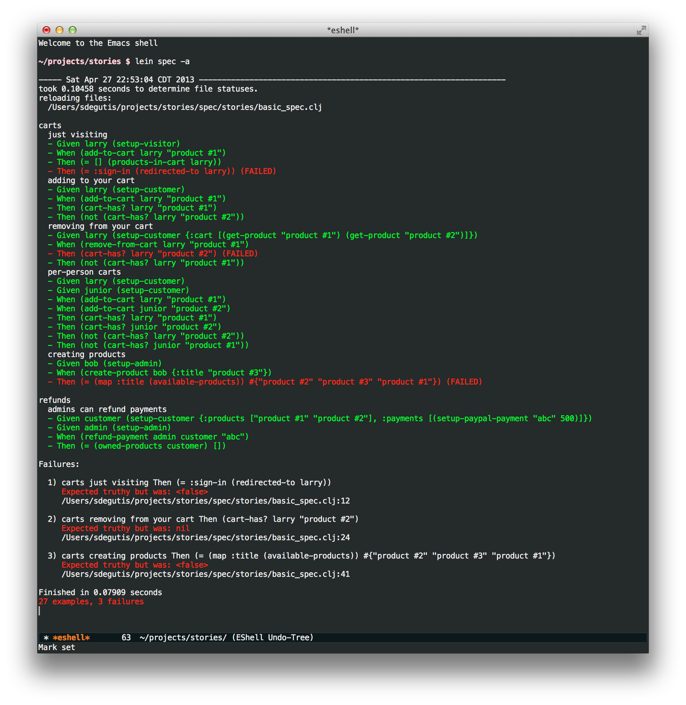

# stories

Freeform BDD lib for Clojure

## Install

Get it from clojars

## Usage

```clojure
(ns stories.basic-spec
  (:require [stories.core :refer :all]
            [fake-website.stories :refer :all]))

(deffeature "carts"

  (defbackground
    (setup-database)
    (setup-product {:title "product #1" :price 200})
    (setup-product {:title "product #2" :price 300}))

  (defstory "just visiting"
    (Given larry (setup-visitor))
    (When (add-to-cart larry "product #1"))
    (Then (= [] (products-in-cart larry))
          (= :sign-in (redirected-to larry))))

  (defstory "adding to your cart"
    (Given larry (setup-customer))
    (When (add-to-cart larry "product #1"))
    (Then (cart-has? larry "product #1")
          (not (cart-has? larry "product #2"))))

  (defstory "removing from your cart"
    (Given larry (setup-customer {:cart [(get-product "product #1")
                                         (get-product "product #2")]}))
    (When (remove-from-cart larry "product #1"))
    (Then (cart-has? larry "product #2")
          (not (cart-has? larry "product #1"))))

  (defstory "per-person carts"
    (Given larry (setup-customer)
           junior (setup-customer))
    (When (add-to-cart larry  "product #1")
          (add-to-cart junior "product #2"))
    (Then (cart-has? larry  "product #1")
          (cart-has? junior "product #2")
          (not (cart-has? larry  "product #2"))
          (not (cart-has? junior "product #1"))))

  (defstory "creating products"
    (Given bob (setup-admin))
    (When (create-product bob {:title "product #3"}))
    (Then (= (map :title (available-products))
             #{"product #1", "product #2", "product #3"})))

  )

(deffeature "refunds"

  (defbackground
    (setup-database)
    (setup-product {:title "product #1" :price 200})
    (setup-product {:title "product #2" :price 300}))

  (defstory "admins can refund payments"
    (Given customer (setup-customer {:products ["product #1" "product #2"]
                                     :payments [(setup-paypal-payment "abc" 500)]})
           admin (setup-admin))
    (When (refund-payment admin customer "abc"))
    (Then (= (owned-products customer)
             [])))

  )
```



And here are the step definitions:

```clojure
(ns fake-website.stories
  (:require [hyperion.api :refer :all]
            [hyperion.memory :refer [new-memory-datastore]]))

;; we should be able to read these step definitions and immediately so
;; "oh yeah i understand this perfectly" and have full assurrance and
;; confidence in the test suite.

;; step definitions have to be THIN. not doing too much translation
;; between the DSL and the real code. otherwise it becomes useless.


;; test setup

(defn setup-database []
  (set-ds! (new-memory-datastore)))

(defn setup-product [mapping]
  (save (merge {:kind :product} mapping)))

(defn setup-visitor []
  (save {:kind :user :cart []}))

(defn get-product [title]
  (find-by-kind :product
                :filters [[:= :title title]]))

(defn setup-customer
  ([attrs]
     (save (merge {:kind :user
                   :signed-in true
                   :cart []} attrs)))
  ([]
     (save {:kind :user
            :signed-in true
            :cart []})))

(defn setup-admin []
  (save {:kind :user :is-admin true}))

(defn setup-paypal-payment [id amount]
  (save {:kind :paypal-payment :id id :amount amount}))


;; user actions

(defn add-to-cart [who title]
  (if (:signed-in who)
    (save who :cart (conj (get-product title) (:cart who)))))

(defn remove-from-cart [who title]
  (if (:signed-in who)
    (let [product (get-product title)]
      (save who :cart (remove #{product} (:cart who))))))

(defn create-product [who title]
  )

(defn refund-payment [admin customer id]
  )


;; user predicates

(defn products-in-cart [user]
  (:cart (reload user)))

(defn redirected-to [user]
  )

(defn cart-has? [user title]
  (some #{title} (map :title (:cart (reload user)))))

(defn available-products []
  (find-by-kind :product))

(defn owned-products [user]
  []
  )
```

## License

Copyright © 2013 Steven Degutis

Distributed under the MIT license because who cares, really. (Except RMS but that guy's not right-in-the-head.)
